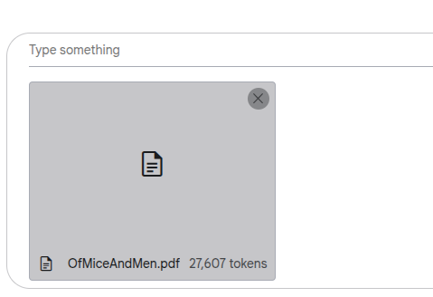

# Structured Gemini Prompts (And Doc Analysis Demo)

This repository contains examples of structured prompts configured in Gemini for generating predictable, formatted outputs. These prompts leverage AI Studio's visual schema editor to define and enforce output structures.

## Overview

The repository demonstrates how to create structured prompts that produce consistent, well-formatted outputs from Gemini. The examples showcase how to utilize Gemini 2.5's extensive continuous output capabilities for document analysis and structured data generation.

## Key Features

- Visual Schema Editor: AI Studio provides an intuitive visual editor for defining output schemas
- Auto-generated Schema: The editor automatically generates the necessary JSON schema definitions
- Structured Outputs: Ensures consistent, predictable response formats
- Format Flexibility: Generate structured data that can be easily converted to JSON, CSV, XLSX, etc.

## Examples

The repository includes two example workloads:

1. British English Deviation Analysis
2. PDF Currency Identification

Each example contains:
- A system prompt file (`system-prompt.md`)
- A JSON schema definition (`schema.json`)

## Benefits

- Predictable Outputs: Enforce specific response structures
- Enhanced Analysis: Leverage Gemini 2.5's extended output capacity for comprehensive document analysis
- Format Conversion: Generate structured data that easily converts to various formats
- Scalable Approach: Add as many custom workloads as needed
  
  ## Visual Schema Editor (Google AI Studio)

  Enormously useful!

  

  

  ## How To Use In Google AI Studio

 AI Studio makes it really easy to set up these kind of structured prompt runs although of course you can also do it using a code only approach (or in Vertex AI etc). The methodology used here took advantage of Gemini 2.5's long output capability to apply these prompts over prepublication book length manuscripts. 

 ### Load System Prompt

 To begin, create a new prompt and load the system prompt into the system prompt area using the UI. 

 

 With the system prompt loaded, we already have the beginnings of an effective and reusable document analysis AI agent!

 

 ### Load Context Data

 Next, load your test document using the drag and drop upload functionality. 

 For whatever reason, I like to use A Tale of Two Cities for all manner of testing. 
 
  

 If you have a manuscript, great, or otherwise use any lengthy document you can find on the Internet once you have appropriate copyright to. For this demonstration I'm using "Of Mice and Men" because it's written in american english

 Once the text has finished tokenizing, you'll be able to see its token count in the prompt window. 

Enable these structured output setting in the sidebar and then use the Edit button to define your schema

Click on 'run' and the job will start running:

 The Gemini 2.5 edition that has really brought this capability forward is the greatly increased maximum continuous output length. 

 

 It's a thinking models that will take some time to run through It's thought process, but eventually you will begin seeing your output in JSON showing that the output adheres to your defined schema. 

 If you choose to click into the thinking process you can actually see it working page by page as it analyzes the potentially non British words found on every page of the text. 

 

 Once you have the data in this manner, you can easily reformat it to CSV, XLSX and take it into a database platform or do just about anything else with it

 Finally, the array is returned:

 

 The output is included in this repository as a demonstration. 